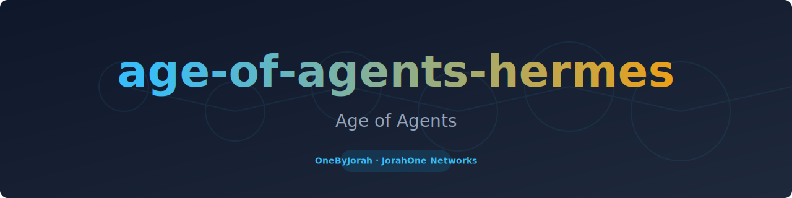
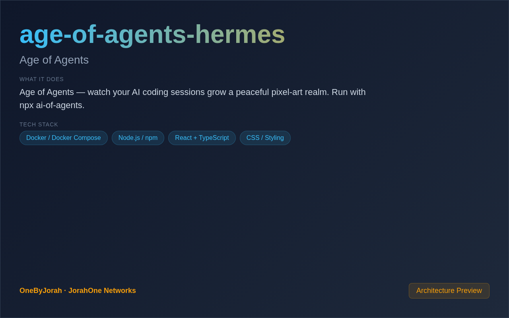

<div align="center">



# age-of-agents-hermes

Age of Agents


</div>

---

<p align="center">
  
</p>

<br>

---

## Features

- **Real-Time Visualization** — Watch AI agents build a pixel-art world.
- **Agent Activity** — See coding sessions as peaceful realm growth.
- **Multiple Themes** — Fantasy and sci-fi visual modes.
- **Zero Configuration** — Run directly with npx.
- **Lightweight** — No database, no backend, just visualization.
- **Retro Pixel Art** — Beautiful 16-bit style graphics.

## Quick Start

```bash
npx ai-of-agents
```

Open **http://localhost:3000** in your browser.

### Install Globally

```bash
npm install -g ai-of-agents
ai-of-agents
```

### Clone and Run

```bash
git clone https://github.com/OneByJorah/age-of-agents-hermes.git
cd age-of-agents-hermes
npm install
npm start
```

## How It Works

1. **Session Detection** — Connects to your Hermes AgentOS sessions
2. **Activity Mapping** — Maps coding activity to realm events
3. **Pixel Rendering** — Renders a peaceful pixel-art world
4. **Real-Time Updates** — Watch the realm grow as you code

## Configuration

| Variable | Default | Description |
|----------|---------|-------------|
| `PORT` | `3000` | Server port |
| `THEME` | `fantasy` | Visual theme (fantasy/sci-fi) |
| `HERMES_API` | — | Hermes AgentOS API endpoint |
| `SESSION_FILE` | — | Local session JSON file |

## Visual Themes

| Theme | Description |
|-------|-------------|
| `fantasy` | Medieval castles, forests, and creatures |
| `sci-fi` | Futuristic stations, robots, and technology |

## Architecture

```
Hermes Sessions ──JSON──▶ Node.js Server ──Canvas──▶ Browser
                                    │
                                    ├──▶ Session Parser
                                    ├──▶ Realm Generator
                                    └──▶ Pixel Renderer
```

## Project Structure

```
age-of-agents-hermes/
├── src/
│   ├── index.js           # Main entry point
│   ├── session-parser.js  # Parse agent sessions
│   ├── realm-generator.js # Generate pixel world
│   └── themes/            # Visual theme configs
├── public/
│   ├── index.html         # Main page
│   ├── canvas.js          # Canvas rendering
│   └── styles.css         # Styles
├── package.json
└── README.md
```

## Contributing

Contributions are welcome. Please see [CONTRIBUTING.md](CONTRIBUTING.md) for guidelines and [CODE_OF_CONDUCT.md](CODE_OF_CONDUCT.md) for community standards.

## Security

For security concerns, see [SECURITY.md](SECURITY.md). Please report vulnerabilities to **info@jorahone.com** — do not use public issues.

## License

MIT © Jhonattan L. Jimenez

---

## 🤝 Contributing

See [CONTRIBUTING.md](CONTRIBUTING.md). All contributions follow the [Code of Conduct](CODE_OF_CONDUCT.md).

## 🔒 Security

Found a vulnerability? Please follow our [Security Policy](SECURITY.md) and report privately to `security@jorahone.com`.

## 📄 License

[Other](LICENSE) © Jhonattan L. Jimenez (OneByJorah)

---

<p align="center">Built with 🌴 by <a href="https://github.com/OneByJorah">OneByJorah</a> · <a href="https://jorahone.com">jorahone.com</a></p>
